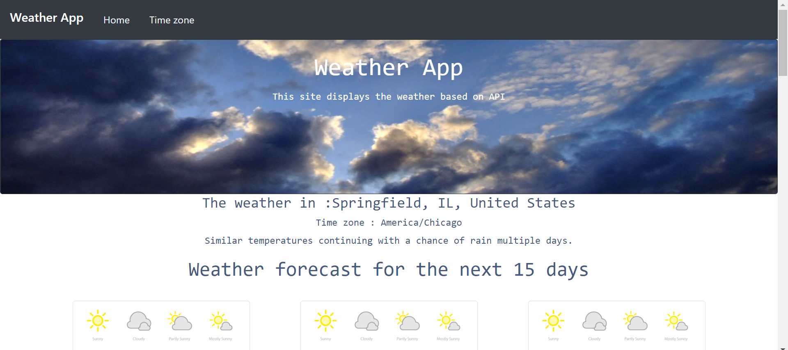

  
 # مشروع الإسبوع الثاني 
  
   
   
  
  ## الوصف
تطبيق يعرض حالة الطقس والتوقيت المحلي لمدينة معينه بإستخدام API
 
 

##  المتطلبات 
- تطبيق State
- تطبيق دالتين على الأقل من دوال Lifecycle
- تطبيق axios

  
 # **الصفحة الرئيسية**

 

  

