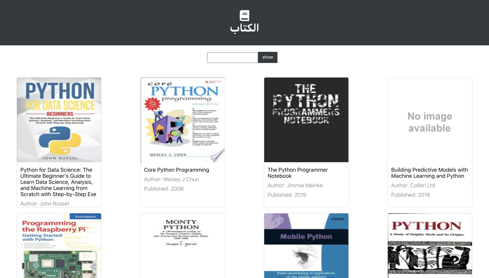

  
 # مشروع الإسبوع الثاني 
  
   
  
   
  باستخدام google Book API

  ## الوصف
اختيار فكرة المشروع راجعة للطالب بحيث يتم ادراج المتطلبات ادناه كاملةً. 
 
 

##  المتطلبات 
- تطبيق State✅
- تطبيق دالتين على الأقل من دوال Lifecycle✅
- تطبيق axios✅

  
   **ملاحظة** :
  بعد الانتهاء من تنفيذ المشروع يرجى إضافة صورة من واجهة الصفحة في ملف README.md✅

  

